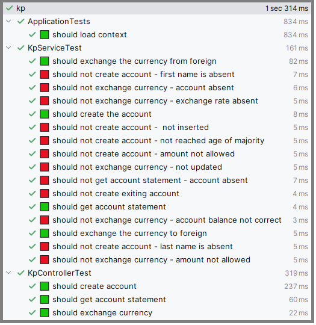
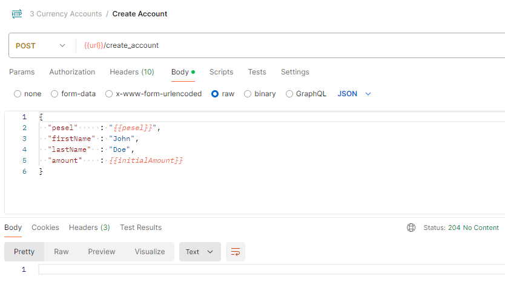
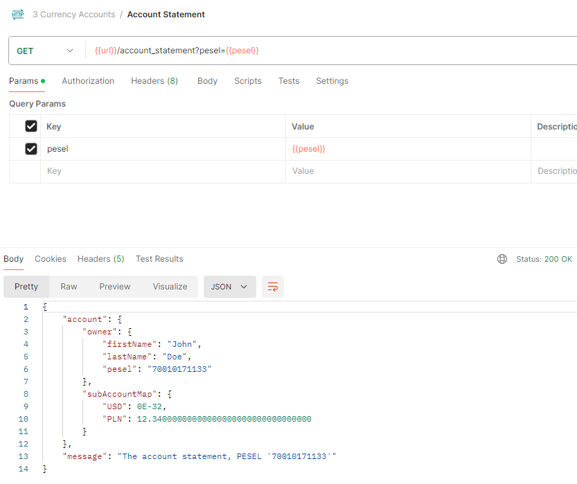
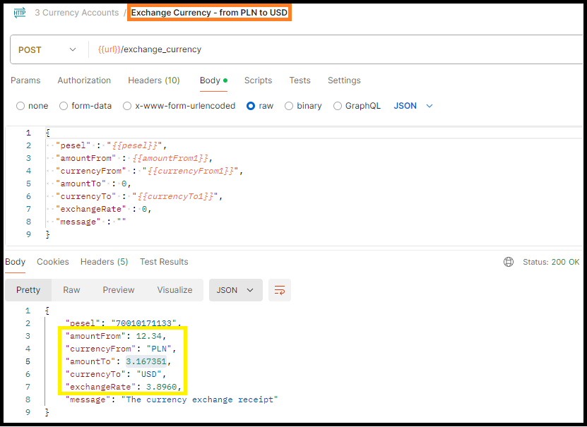
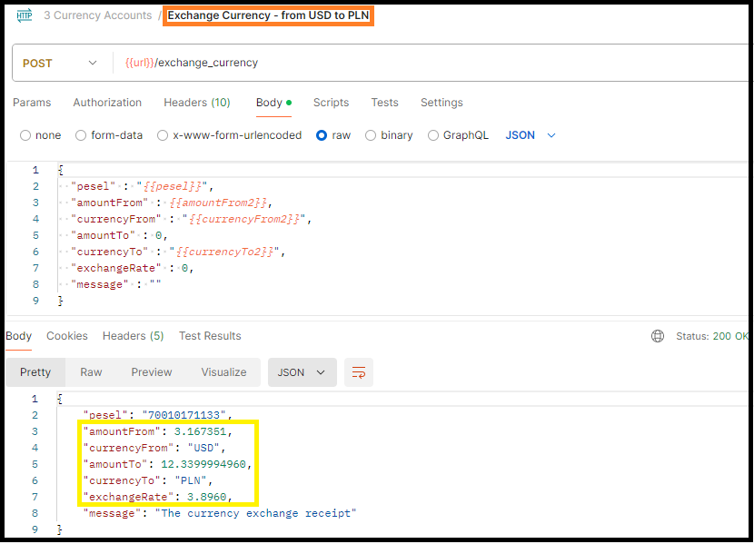
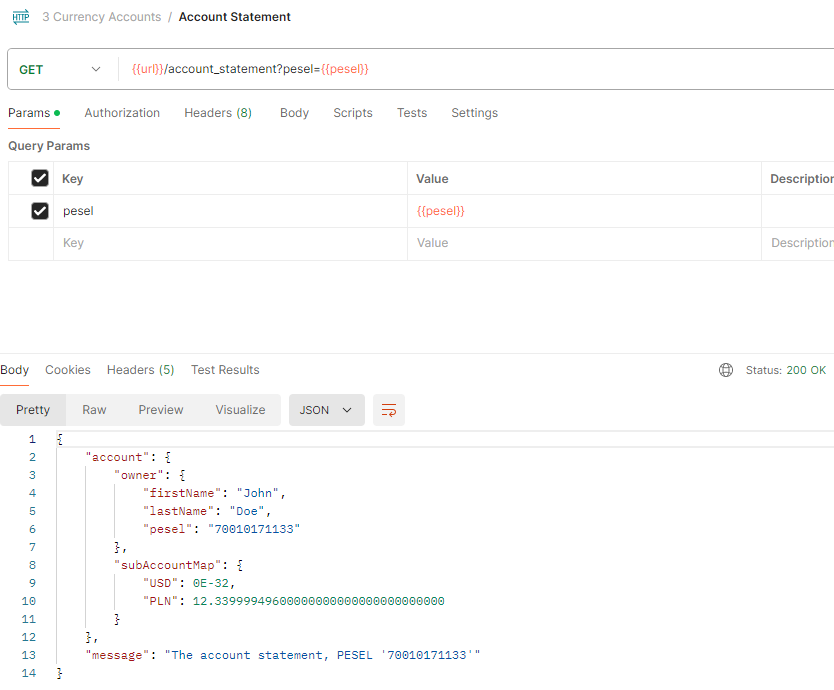
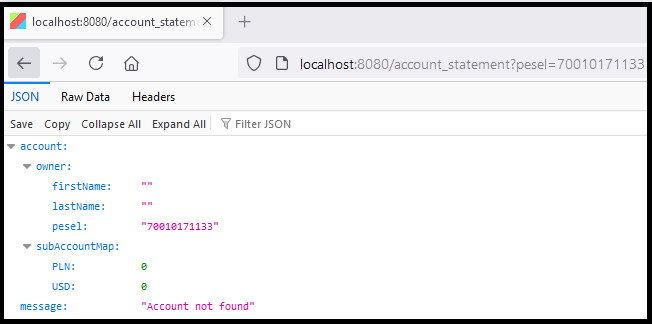
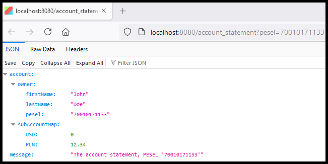

# Currency Accounts

This is the Spring Boot application with HyperSQL database.

<ul>
<li><a href="https://github.com/Ee-Cs/CurrencyAccounts/blob/main/docs/mermaid/flowchart.md">flowchart diagram</a>
with endpoints</li>
<li><a href="https://htmlpreview.github.io/?https://github.com/Ee-Cs/CurrencyAccounts/blob/main/docs/apidocs/index.html">
Java API Documentation</a></li>
</ul>

<h2>❶ Java source code</h2>

The account:
<a href="https://github.com/Ee-Cs/CurrencyAccounts/blob/main/src/main/java/kp/domain/Account.java#L17">
kp.domain.Account</a>. 

The "account creation" endpoint logic. 
The controller method:
<a href="https://github.com/Ee-Cs/CurrencyAccounts/blob/main/src/main/java/kp/controller/KpController.java#L41">
kp.controller.KpController::createAccount</a>. 
The service method:
<a href="https://github.com/Ee-Cs/CurrencyAccounts/blob/main/src/main/java/kp/services/KpService.java#L46">
kp.services.KpService::createAccount</a>.

The "exchange currency" endpoint logic. 
The controller method:
<a href="https://github.com/Ee-Cs/CurrencyAccounts/blob/main/src/main/java/kp/controller/KpController.java#L58">
kp.controller.KpController::exchangeCurrency</a>. 
The service method:
<a href="https://github.com/Ee-Cs/CurrencyAccounts/blob/main/src/main/java/kp/services/KpService.java#L70">
kp.services.KpService::exchangeCurrency</a>.

The "account statement" endpoint logic. 
The controller method:
<a href="https://github.com/Ee-Cs/CurrencyAccounts/blob/main/src/main/java/kp/controller/KpController.java#L72">
kp.controller.KpController::getAccountStatement</a>. 
The service method:
<a href="https://github.com/Ee-Cs/CurrencyAccounts/blob/main/src/main/java/kp/services/KpService.java#L108">
kp.services.KpService::getAccountStatement</a>.

The National Bank client service method:
<a href="https://github.com/Ee-Cs/CurrencyAccounts/blob/main/src/main/java/kp/services/ExchangeRateService.java#L38">
kp.services.ExchangeRateService::getExchangeRate</a>. 
The National Bank <a href="http://api.nbp.pl/api/exchangerates/rates/a/usd/">
exchange rates endpoint</a> used in this application. 

<h2>❷ The tests</h2>
<h3>𝓐.</h3>

The tests Java source code - <a href="https://github.com/Ee-Cs/CurrencyAccounts/tree/main/src/test/java/kp">
root package</a>. The tests use JUnit Jupiter, Mockito, and MockMvc.

<h3>𝓑.</h3>

There are 20 tests defined in "Currency Accounts" application.

The screenshot of these tests execution in IntelliJ IDEA: 

<h3>𝓒.</h3>

The endpoint tests in Postman.
The exported <a href="https://github.com/Ee-Cs/CurrencyAccounts/blob/main/docs/postman/3%20Currency%20Accounts.postman_collection.json">
Postman collection</a>.

<ol>The amount checking test scenario:
<li>create the account</li>
<li>get the account statement</li>
<li>exchange the currency - PLN → USD</li>
<li>get the account statement</li>
<li>exchange the currency - USD → PLN</li>
<li>get the account statement</li>
</ol>
<ul>The given initial amount value should be transacted this way:
<li>after account creation the initial amount is in PLN, zero amount is in USD</li>
<li>after 1st transaction initial amount is exchanged to USD, no amount left in PLN</li>
<li>after 2nd transaction initial amount is exchanged back to PLN, no amount left in USD</li>
<li>after these two transactions the account balance should not differ from original 
    (of course with small roundings)</li>
</ul>

The screenshots of this test scenario executed in Postman. 

1. Creating the account: 

2. The account statement after account creation: 

3. The currency exchange from local (PLN) to foreign (USD): 

4. The account statement after exchange from PLN to USD: 

5. The currency exchange from foreign (USD) to local (PLN): 

6. The account statement after exchange from USD to PLN: 

<h3>𝓓.</h3>

The screenshots of the application responses in the Firefox Browser. 

The account statement before the account creation: 

The account statement after the account creation: 
 

<h4>❸ Some future design ideas</h4>
<ul>
<li>add authentication and authorization</li>
<li>try Native Image compilation with GraalVM</li>
<li>extend account data with dates and add more personal details (like address, phone number)</li>
<li>refactor database schema</li>
<li>switch to PostgreSQL database</li>
<li>save exchange receipts to database</li> 
<li>add endpoint for account deleting</li>
<li>add endpoints for more account transactions types (like money withdrawing etc.)</li>
<li>add endpoints for customer activity reporting (like number of currency exchanges per week)</li>
<li>maybe it would be needed to add the foreign exchange commission or other fees</li>
<li>generate the endpoint from OpenApi yaml file, use Swagger</li>
<li>move to Docker, or Kubernetes, or cloud (like AWS, MS Azure, or Google Cloud Platform)</li>
<li>after refactoring, add more tests</li>
</ul>

