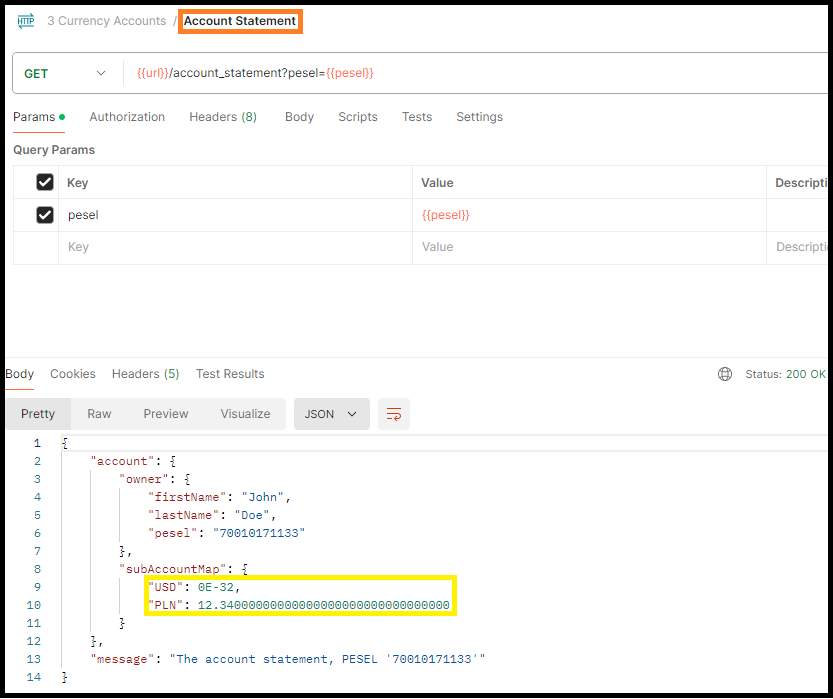
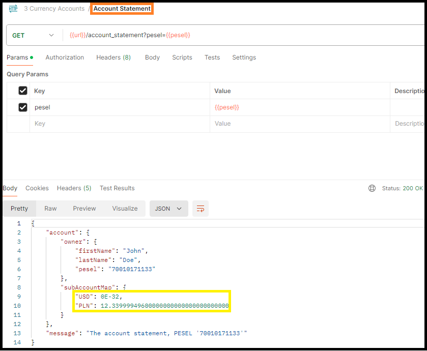

# CurrencyAccounts

The <a href="https://github.com/Ee-Cs/CurrencyAccounts/blob/main/docs/mermaid/flowchart.md">flowchart diagram</a>
with endpoints.

<h3>❶ The Java classes</h3>

The account creation endpoint logic. 
The controller method:
<a href="https://github.com/Ee-Cs/CurrencyAccounts/blob/main/src/main/java/kp/controller/KpController.java#L41">
kp.controller.KpController::createAccount</a>. 
The service method:
<a href="https://github.com/Ee-Cs/CurrencyAccounts/blob/main/src/main/java/kp/services/KpService.java#L46">
kp.services.KpService::createAccount</a>.

The exchange currency endpoint logic. 
The controller method:
<a href="https://github.com/Ee-Cs/CurrencyAccounts/blob/main/src/main/java/kp/controller/KpController.java#L58">
kp.controller.KpController::exchangeCurrency</a>. 
The service method:
<a href="https://github.com/Ee-Cs/CurrencyAccounts/blob/main/src/main/java/kp/services/KpService.java#L70">
kp.services.KpService::exchangeCurrency</a>.

The account statement endpoint logic. 
The controller method:
<a href="https://github.com/Ee-Cs/CurrencyAccounts/blob/main/src/main/java/kp/controller/KpController.java#L72">
kp.controller.KpController::getAccountStatement</a>. 
The service method:
<a href="https://github.com/Ee-Cs/CurrencyAccounts/blob/main/src/main/java/kp/services/KpService.java#L108">
kp.services.KpService::getAccountStatement</a>.

The National Bank client service method:
<a href="https://github.com/Ee-Cs/CurrencyAccounts/blob/main/src/main/java/kp/services/ExchangeRateService.java#L38">
kp.services.ExchangeRateService::getExchangeRate</a>. 
The National Bank <a href="http://api.nbp.pl/api/exchangerates/rates/a/usd/">
exchange rates endpoint</a> used in this application. 

<h3>❷ The tests</h3>

The <a href="https://github.com/Ee-Cs/CurrencyAccounts/tree/main/src/test/java/kp">
test classes</a>. They use JUnit Jupiter and MockMvc.

The screenshot of the 20 application tests executed in IntelliJ IDEA: 

The endpoint tests in Postman.
The exported <a href="https://github.com/Ee-Cs/CurrencyAccounts/blob/main/docs/postman/3%20Currency%20Accounts.postman_collection.json">
Postman collection</a>.

<ol>The test scenario:
<li>create the account</li>
<li>get account statement</li>
<li>exchange currency PLN → USD</li>
<li>get account statement</li>
<li>exchange currency USD → PLN</li>
<li>get account statement</li>
</ol>

The screenshots of this test scenario executed in Postman. 

1. Creating the account: 

2. The account statement after creation: 

3. The currency exchange from local (PLN) to foreign (USD): 

4. The account statement after exchange from PLN to USD: 

5. The currency exchange from foreign (USD) to local (PLN): 

6. The account statement after exchange from USD to PLN: 

As it is presented on the above screenshot, after these two transactions (PLN → USD and USD → PLN)
the account balance is not different from original (of course with small roundings).  

<h3>❸ The documentation</h3>

<a href="https://htmlpreview.github.io/?https://github.com/Ee-Cs/CurrencyAccounts/blob/main/docs/apidocs/index.html">
Java API Documentation</a>

<h3>❹ The future design ideas</h3>
<ul>
<li>authentication and authorization</li>
<li>extend data with dates and more personal data</li>
<li>refactor database schema</li>
<li>switch to PostgreSQL database</li>
<li>save exchange receipts to database</li> 
<li>add endpoint for account deleting</li>
<li>add endpoints for more account transactions types (like money withdrawing etc.)</li>
<li>add endpoints for customer activity reporting</li>
<li>add foreign exchange commission</li>
<li>generate the endpoint from OpenApi yaml file</li>
<li>move to Docker, or Kubernetes, or cloud (AWS, MS Azure or Google Cloud Platform)</li>
</ul>

