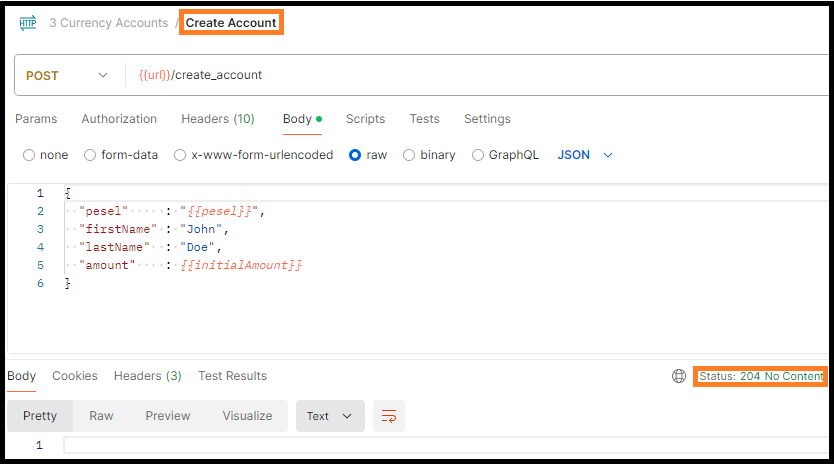

# CurrencyAccounts

The flowchart diagram .

<h3>The account creation endpoint logic</h3>

The controller method:
<a href="https://github.com/Ee-Cs/CurrencyAccounts/blob/main/src/main/java/kp/controller/KpController.java#L41">
kp.controller.KpController::createAccount</a>.

The service method:
<a href="https://github.com/Ee-Cs/CurrencyAccounts/blob/main/src/main/java/kp/services/KpService.java#L46">
kp.services.KpService::createAccount</a>.

<h3>The exchange currency endpoint logic</h3>

The controller method:
<a href="https://github.com/Ee-Cs/CurrencyAccounts/blob/main/src/main/java/kp/controller/KpController.java#L58">
kp.controller.KpController::exchangeCurrency</a>.

The service method:
<a href="https://github.com/Ee-Cs/CurrencyAccounts/blob/main/src/main/java/kp/services/KpService.java#L70">
kp.services.KpService::exchangeCurrency</a>.

<h3>The account statement endpoint logic</h3>

The controller method:
<a href="https://github.com/Ee-Cs/CurrencyAccounts/blob/main/src/main/java/kp/controller/KpController.java#L72">
kp.controller.KpController::getAccountStatement</a>.

The service method:
<a href="https://github.com/Ee-Cs/CurrencyAccounts/blob/main/src/main/java/kp/services/KpService.java#L108">
kp.services.KpService::getAccountStatement</a>.

<h3>The tests</h3>

The <a href="https://github.com/Ee-Cs/CurrencyAccounts/tree/main/src/test/java/kp">
tests</a>. 
The controller tests use JUnit Jupiter and MockMvc.

Application tests executed in IntelliJ IDEA 

Test scenario executed in Postman 

1. Creating the account: 

2. The account statement after creation: 

3. The currency exchange from local (PLN) to foreign (USD): 

4. The account statement after exchange from PLN to USD: 

5. The currency exchange from foreign (USD) to local (PLN): 

6. The account statement after exchange from USD to PLN: 

After these two transactions the account balance is not different from original (with small roundings).  

<h3>The documentation</h3>

<a href="https://htmlpreview.github.io/?https://github.com/Ee-Cs/CurrencyAccounts/blob/main/docs/apidocs/index.html">
Java API Documentation</a>

<h3>The design propositions</h3>
<ul>
<li>refactor database schema and change to PostgreSQL database</li>
<li>add endpoint for account deleting</li>
<li>add endpoints for more account transactions (like money withdrawing etc.)</li>
<li>add endpoints for customer activity reporting</li>
<li>add foreign exchange commission</li>
<li>generate the endpoint from OpenApi yaml file</li>
<li>move to Docker, or Kubernetes, or cloud (AWS, MS Azure or Google Cloud Platform)</li>
</ul>
	

