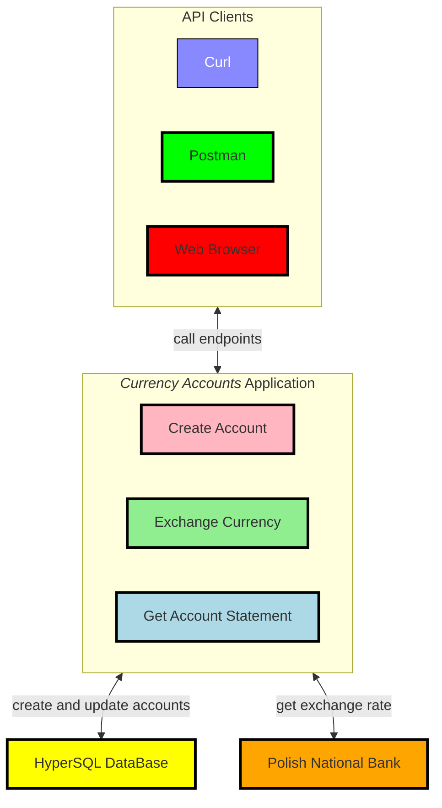

```mermaid
flowchart TD
 subgraph APP[<i>Currency Accounts</i> Application]
   CA[Create Account]:::lightPinkBox
   EX[Exchange Currency]:::lightGreenBox
   AS[Get Account Statement]:::lightBlueBox
 end
 DB[HyperSQL DataBase]:::yellowBox
 NBP[Polish National Bank]:::orangeBox
 subgraph CLI[API Clients]
   CURL[Curl]:::blueBox
   POST[Postman]:::greenBox
   WBR[Web Browser]:::redBox
 end

 CLI <--> |call endpoints| APP
 APP <--> |create and update accounts| DB
 APP <--> |get exchange rate| NBP

 classDef redBox     fill:#ff0000,stroke:#000,stroke-width:3px
 classDef greenBox   fill:#00ff00,stroke:#000,stroke-width:3px
 classDef blueBox    fill:#8888ff,stroke:#000,stroke-width:1px,color:#fff
 classDef orangeBox  fill:#ffa500,stroke:#000,stroke-width:3px
 classDef yellowBox  fill:#ffff00,stroke:#000,stroke-width:3px
 classDef yellowBox  fill:#ffff00,stroke:#000,stroke-width:3px
 classDef yellowBox  fill:#ffff00,stroke:#000,stroke-width:3px
 classDef yellowBox  fill:#ffff00,stroke:#000,stroke-width:3px
 classDef lightBlueBox  fill:#ADD8E6,stroke:#000,stroke-width:3px
 classDef lightGreenBox fill:#90EE90,stroke:#000,stroke-width:3px
 classDef lightPinkBox  fill:#FFB6C1,stroke:#000,stroke-width:3px
```